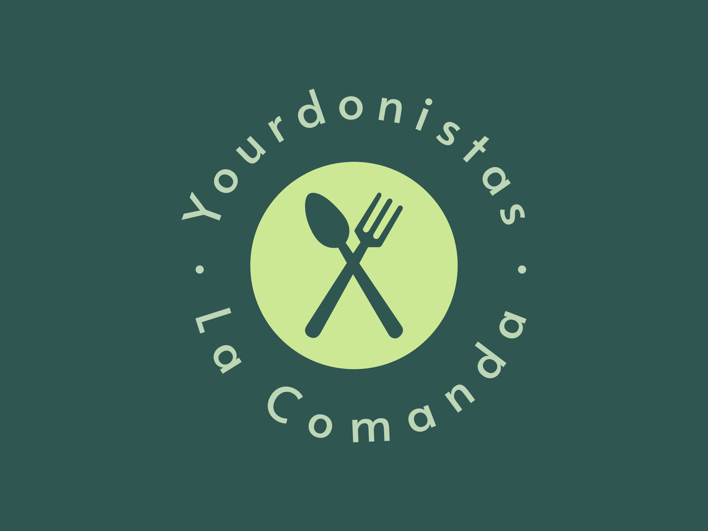

# Equipo Los Yourdonistas

# ¿Qué es?

Una aplicación móvil que permite gestionar y administrar tanto los pedidos así como los clientes y empleados de un restaurante.

# ¿Quiénes somos?

 Alumnos de la Tecnicatura Universitaria en programación - UTN FRA 🙌

# Integrantes 🙉🙊🙈

- Marcos Laporte [Alfa]
- Jaco Tomás Luna Pierini [Beta]
- Yober Marlow Vasquez Panduro [Gama]

# Tareas

| # | Tarea                  | Responsable | Estado     |
| - | ---------------------- | ----------- | ---------- |
| - | Generacion de proyecto | Equipo      | Terminado  |
| - | Iconos + Splash        | Marcos      | En trabajo |
| - | Login                  | Marcos      | Pendiente  |
| - | Registro               | Marcos      | Pendiente  |
| A | Alta dueño/supervisor | Jaco        | Pendiente  |
| B | Alta empleados         | Marcos      | Pendiente  |
| C | Alta cliente           | Yober       | Pendiente  |
| D | Alta mesa              | Jaco        | Pendiente  |
| E | Alta producto          | Yober       | Pendiente  |
