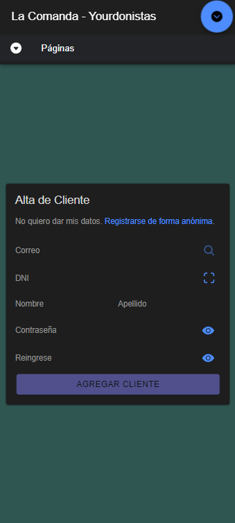
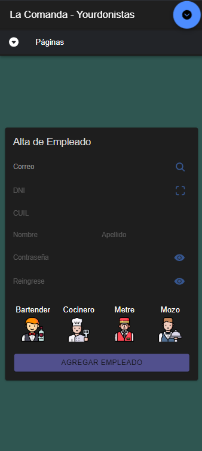
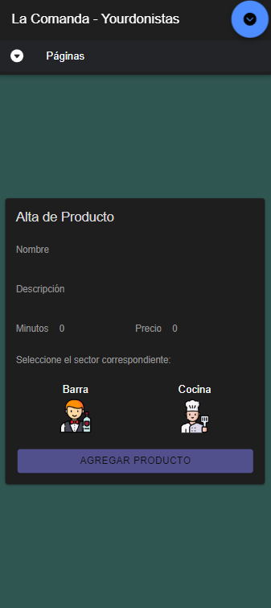
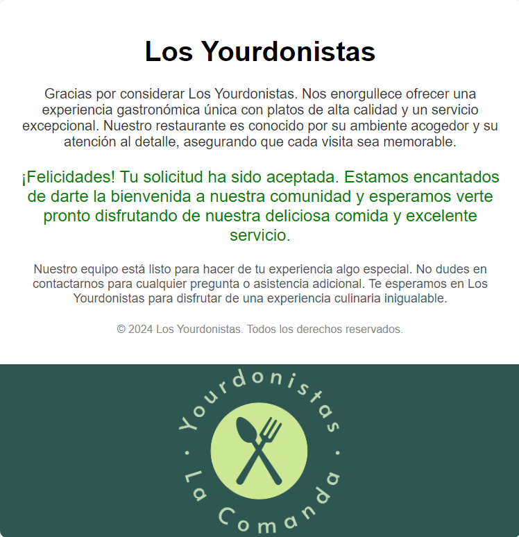

# Equipo Los Yourdonistas

# ¿Qué es?

Una aplicación móvil que permite gestionar y administrar tanto los pedidos así como los clientes y empleados de un restaurante.

# ¿Quiénes somos?

 Alumnos de la Tecnicatura Universitaria en programación - UTN FRA

## Integrantes 🙉🙊🙈

- Marcos Laporte [Alfa]
- Jaco Tomás Luna Pierini [Beta]
- Yober Marlow Vasquez Panduro [Gama]

# Ramas

Cada integrante tiene su propia rama para subir sus avances, y una rama **Test** donde subimmos las funcionalidades ya hechas, para luego subirlas a **Master** como un conjunto.

# Tareas

| #  | Tarea                             | Responsable | Estado    |
| -- | --------------------------------- | ----------- | --------- |
| -  | Generacion de proyecto            | Equipo      | Terminado |
| -  | Iconos + Splash                   | Marcos      | Terminado |
| -  | Login                             | Marcos      | Terminado |
| -  | Registro                          | Marcos      | Pendiente |
| A  | Alta dueño/supervisor            | Jaco        | Terminado |
| B  | Alta empleados                    | Marcos      | Terminado |
| C  | Alta cliente                      | Yober       | Terminado |
| D  | Alta mesa                         | Jaco        | Terminado |
| E  | Alta producto                     | Yober       | Terminado |
| F  | Qr ingreso al local               | Marcos      | Terminado |
| G  | Qr de la mesa                     | Jaco        | Terminado |
| H  | Qr de propina                     | Yober       | Pendiente |
| I  | Encuesta Cliente                  | Yober       | Terminado |
| J  | Encuesta Empleado                 | Marcos      | Terminado |
| K  | Encuesta Supervisor               | Jaco        | Pendiente |
| L  | Agregar cliente registrado        | Yober       | Terminado |
| M  | Ingresar al local                 | Marcos      | Terminado |
| N  | Pedir platos y bebidas            | Jaco        | Terminado |
| O  | Confirmar pedido                  | Marcos      | Terminado |
| P  | Hacer reservas agendadas          | Yober       | Pendiente |
| Q  | PushN - Cliente nuevo             | Yober       | Terminado |
| R  | PushN - Ingreso al local          | Yober       | Terminado |
| S  | PushN - Consultar mozo            | Jaco        | Terminado |
| T  | PushN - Confirmar pedido          | Jaco        | Terminado |
| U  | PushN - Pedido listo              | Marcos      | Terminado |
| V  | PushN - Generar reservas/Delivery | Marcos      | Pendiente |
| W  | Delivery - Hacer pedido con GPS   | Pendiente   |           |
| X  | Delivery - Mapa                   | Pendiente   |           |
| Y  | Juego 10% descuento               | Pendiente   |           |
| Z  | Juego 15% descuento               | Pendiente   |           |
| AA | Juego 20% descuento               | Pendiente   |           |

# Páginas

### Alta Usuario

| Cliente                                                             | Empleado                                        | Supervisor                                          |
| ------------------------------------------------------------------- | ----------------------------------------------- | --------------------------------------------------- |
|  |  |  |

### Varios

| Mesa                                    | Producto                                        | Pedido                                      |
| :-------------------------------------- | ----------------------------------------------- | ------------------------------------------- |
|  |  |  |

### Encuesta cliente

| Alta                                                            | Gráficos                                                                 |
| --------------------------------------------------------------- | ------------------------------------------------------------------------- |
|  |  |

# Correos

| Cliente aceptado                                        | Cliente rechazado                              |
| ------------------------------------------------------- | ---------------------------------------------- |
|  |  |
